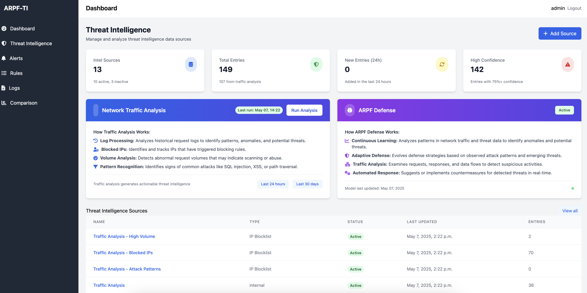
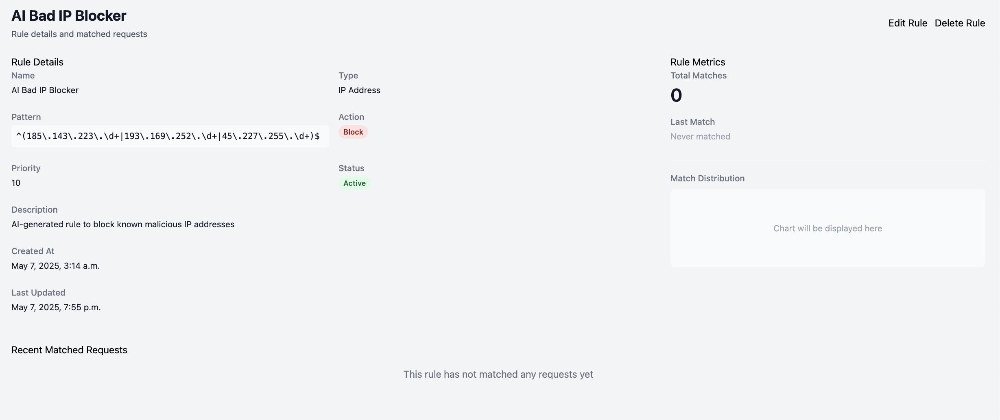
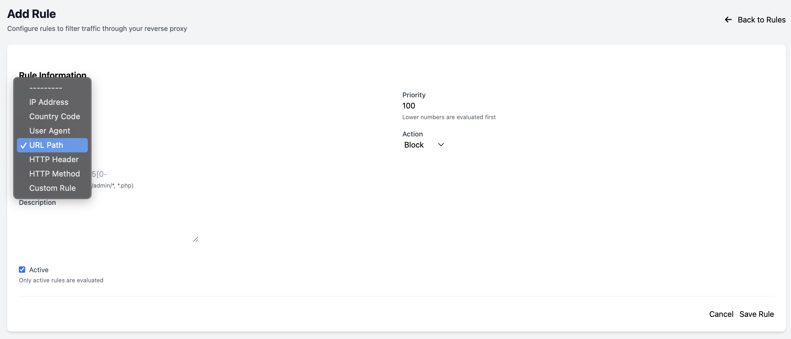
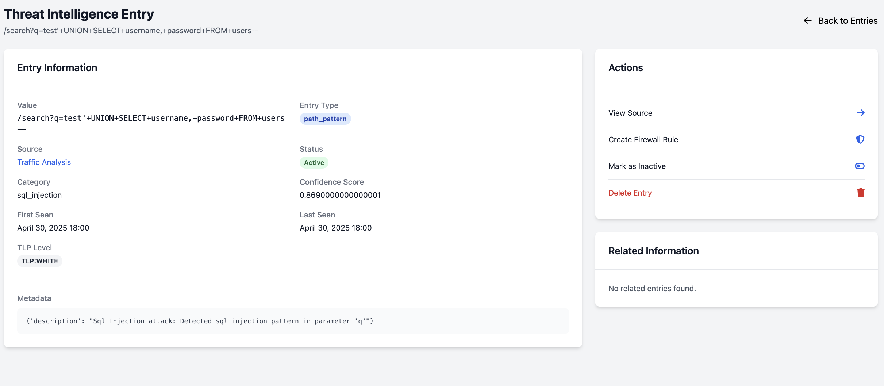

# ARPF-TI: Enhancing Network Security Through AI-Driven Threat Intelligence Integration

## Presentation Overview

- The Challenge of Modern Network Security
- ARPF-TI Framework Overview
- System Architecture
- AI Implementation
- Threat Intelligence Integration
- Evaluation Methodology
- Key Results
- Practical Implications
- Future Directions

---

## The Challenge of Modern Network Security

- Traditional firewalls are increasingly insufficient against:
  - Advanced persistent threats
  - Zero-day exploits
  - Application-layer attacks
  
- Security teams face:
  - Increasing attack sophistication
  - Alert fatigue
  - Resource constraints
  - Rapid response requirements

---

## ARPF-TI Framework Overview

**Advanced Rule-based Protection Framework with Threat Intelligence**

- Next-generation firewall solution integrating:
  - AI-powered threat analysis
  - Real-time traffic anomaly detection
  - Comprehensive threat intelligence
  - Automated rule generation and response

- Open-source implementation adaptable for various security needs

---

## System Architecture

- **Six Key Components:**
  1. Core Processing Engine
  2. Threat Intelligence Module
  3. AI Analysis System
  4. Alert Management System
  5. Dashboard and Analytics
  6. Comparison Framework

- Implemented as a Django-based web application

---

## AI Implementation

**Dual AI Model Approach:**

| Model | Deployment | Primary Use | Integration |
|-------|------------|-------------|------------|
| Google Gemini | Cloud API | Rule generation, Pattern analysis | REST API |
| TinyLlama (1.1B) | Local | Offline analysis | Local inference |

- Confidence scoring for each rule suggestion
- Continuous feedback loop for improvement
- Human-in-the-loop verification

---

## Threat Intelligence Integration

- **Multiple Intelligence Sources:**
  - MISP (Malware Information Sharing Platform)
  - TAXII/STIX feeds
  - AlienVault OTX
  - Abuse.ch URLhaus
  - PhishTank
  - Emerging Threats Community

---

## Evaluation Methodology

**Comprehensive Testing Approach:**

- 10-day evaluation period
- 6,000+ simulated requests
- 2875 attack attempts across multiple vectors
- Test environment utilizing `/tests/` scripts:
  - `simulate_attacks.py`
  - `generate_traffic_data.py`

- Comparison framework evaluating AI vs. manual rules

---

## Key Results: Rule Generation

- AI system generated **94 rules** vs. 12 manual rules
- AI rules identified more subtle patterns
- Generated more specific rules for various attack vectors

---

## Key Results: Performance Metrics

| Metric | AI Rules | Manual Rules | Improvement |
|--------|----------|--------------|-------------|
| Precision Rate | 89.2% | 71.5% | 17.7% |
| True Positives | 267 | 184 | 45.1% |
| False Positives | 33 | 74 | 55.4% reduction |
| Avg. Response Time | 35.7 min | 42.8 min | 16.6% reduction |

---

## Key Results: Attack Type Effectiveness

- AI rules consistently outperformed manual rules across all attack vectors:
  - SQL Injection: 89% vs. 60%
  - XSS Attacks: 92% vs. 55%
  - Command Injection: 91% vs. 68%
  - Path Traversal: 86% vs. 63%

---

## Reasons for AI Performance Advantage

1. **Pattern Recognition Capability**: Identifies subtle patterns across large datasets
2. **Adaptability**: Continuously learns from new data and feedback
3. **Specificity**: More targeted rules for specific attack variants
4. **Consistency**: Uniform analysis methodology across all traffic

---

## Practical Implications

- **Reduced Alert Fatigue**: 55% fewer false positives
- **Faster Response**: 16.6% reduction in time to implementation
- **Improved Security Posture**: Higher detection rates for sophisticated attacks
- **Resource Optimization**: Security teams can focus on verified threats

---

## Limitations

1. **Training Data Dependency**: System effectiveness tied to training data quality
2. **Computational Requirements**: Higher resource needs than traditional systems
3. **Explainability Challenges**: Complex AI patterns may be difficult to interpret
4. **Test Environment Constraints**: Controlled testing may not fully represent real-world complexity

---

## Future Directions

1. **Hybrid Approaches**: Optimal combinations of AI and human-created rules
2. **Explainable AI**: Enhance understanding of AI-generated rules
3. **Adversarial Resilience**: Strengthen against evasion techniques
4. **Resource Optimization**: More efficient AI implementations
5. **Cross-Organizational Learning**: Federated learning for collective intelligence

---

## Conclusion

- ARPF-TI significantly outperforms traditional rule-based approaches
  - 17.7% higher precision
  - 45% more true positives
  - 55% fewer false positives

- Framework provides foundation for future AI-enhanced security systems

- Open-source implementation available for adaptation and extension

---

## Thank You & Questions

**Contact Information:**
- Email: dkhanal239202@troy.edu | bawasthi@troy.edu
- GitHub: [github.com/yourusername/ARPF-TI](https://github.com/Dibae101/ARPF-TI)